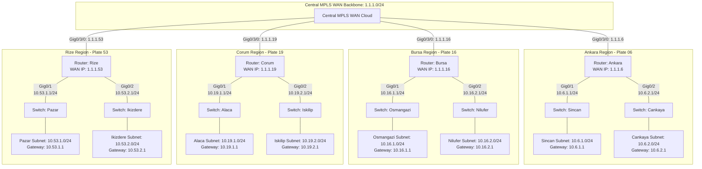

# Cisco Packet Tracer - 4-City Intercity WAN Static Routing & Secure Management Lab

[](https://www.netacad.com/courses/packet-tracer)
[](https://www.cisco.com)
[](LICENSE)
[]()
[]()

A hands-on enterprise networking laboratory designed, implemented, and verified in **Cisco Packet Tracer**. This project demonstrates a multi-regional WAN architecture connecting **4 major cities** across Turkey (**Ankara**, **Bursa**, **Çorum**, and **Rize**) through a central Layer 3 MPLS WAN backbone, incorporating **deterministic static routing**, **dual remote access management (SSH v2 & Telnet)**, and **hardened device security**.

---

## Quick Reference (At a Glance)

| City | Plate | Border Router | WAN IP (`Gig0/3/0`) | District LAN 1 (`Gig0/1`) | District LAN 2 (`Gig0/2`) | Remote Management |
| :--- | :---: | :--- | :--- | :--- | :--- | :--- |
| **Ankara** | `06` | `Ankara` | `1.1.1.6/24` | Sincan (`10.6.1.0/24`) | Çankaya (`10.6.2.0/24`) | SSHv2 & Telnet (`admin`/`user`) |
| **Bursa** | `16` | `Bursa` | `1.1.1.16/24` | Osmangazi (`10.16.1.0/24`) | Nilüfer (`10.16.2.0/24`) | SSHv2 & Telnet (`admin`/`user`) |
| **Çorum** | `19` | `Corum` | `1.1.1.19/24` | Alaca (`10.19.1.0/24`) | İskilip (`10.19.2.0/24`) | SSHv2 & Telnet (`admin`/`user`) |
| **Rize** | `53` | `Rize` | `1.1.1.53/24` | Pazar (`10.53.1.0/24`) | İkizdere (`10.53.2.0/24`) | SSHv2 & Telnet (`admin`/`user`) |

---

## Table of Contents

- [Network Topology](#network-topology)
  - [1. Visual Topology Diagram](#1-visual-topology-diagram)
  - [2. ASCII Architecture Schematic](#2-ascii-architecture-schematic)
  - [3. Interactive Mermaid Topology](#3-interactive-mermaid-topology)
- [IP Addressing Plan](#ip-addressing-plan)
- [Static Routing Architecture & Matrix](#static-routing-architecture--matrix)
  - [Cross-City Routing Matrix](#cross-city-routing-matrix)
  - [Detailed Router Routing Tables](#detailed-router-routing-tables)
- [Device Hardening & Security Architecture](#device-hardening--security-architecture)
- [Cisco IOS Configuration Walkthrough](#cisco-ios-configuration-walkthrough)
- [Verification & Diagnostics Guide](#verification--diagnostics-guide)
- [Repository Structure](#repository-structure)
- [Instructions for Running the Lab](#instructions-for-running-the-lab)
- [Author & License](#author--license)

---

## Network Topology

### 1. Visual Topology Diagram

<div align="center">
  
</div>

<br/>

### 2. ASCII Architecture Schematic

```text
=============================================================================================================
                                        CENTRAL MPLS WAN BACKBONE
                                                1.1.1.0/24
=============================================================================================================
         |                                  |                                  |                            |
         | Gig0/3/0                         | Gig0/3/0                         | Gig0/3/0                   | Gig0/3/0
         | IP: 1.1.1.6/24                   | IP: 1.1.1.16/24                  | IP: 1.1.1.19/24            | IP: 1.1.1.53/24
         v                                  v                                  v                            v
+------------------+              +------------------+               +------------------+         +------------------+
|   ANKARA (06)    |              |    BURSA (16)    |               |    ÇORUM (19)    |         |    RİZE (53)     |
| Router: Ankara   |              | Router: Bursa    |               | Router: Corum    |         | Router: Rize     |
+------------------+              +------------------+               +------------------+         +------------------+
   |            |                    |            |                     |            |               |            |
   | Gig0/1     | Gig0/2             | Gig0/1     | Gig0/2              | Gig0/1     | Gig0/2        | Gig0/1     | Gig0/2
   | 10.6.1.1   | 10.6.2.1           | 10.16.1.1  | 10.16.2.1           | 10.19.1.1  | 10.19.2.1     | 10.53.1.1  | 10.53.2.1
   v            v                    v            v                     v            v               v            v
+------------+ +------------+     +------------+ +------------+      +------------+ +------------+ +------------+ +------------+
|   SİNCAN   | |  ÇANKAYA   |     | OSMANGAZİ  | |  NİLÜFER   |      |   ALACA    | |  İSKİLİP   | |   PAZAR    | |  İKİZDERE  |
| 10.6.1.0/24| | 10.6.2.0/24|     |10.16.1.0/24| |10.16.2.0/24|      |10.19.1.0/24| |10.19.2.0/24| |10.53.1.0/24| |10.53.2.0/24|
+------------+ +------------+     +------------+ +------------+      +------------+ +------------+ +------------+ +------------+
```

<br/>

### 3. Interactive Mermaid Topology



---

## IP Addressing Plan

The addressing scheme is designed hierarchically around Turkish provincial traffic license plate numbers, ensuring clean subnet tracking and intuitive troubleshooting:

### 1. WAN Interconnect Subnet
| Segment | Subnet Address | Mask | CIDR | Usable IP Range | Purpose |
| :--- | :--- | :--- | :---: | :--- | :--- |
| **MPLS WAN Backbone** | `1.1.1.0` | `255.255.255.0` | `/24` | `1.1.1.1 - 1.1.1.254` | Common Layer 3 transit broadcast domain connecting all 4 city routers |

### 2. Detailed Device Interface Addressing
| Device / Hostname | Interface | IP Address | Subnet Mask | Description | Role / Target Segment |
| :--- | :--- | :--- | :--- | :--- | :--- |
| **Ankara Router** | `Gig0/3/0` | `1.1.1.6` | `255.255.255.0` | `to MPLS` | WAN Backbone Uplink Interface |
| **Ankara Router** | `Gig0/1` | `10.6.1.1` | `255.255.255.0` | `to Sincan` | Default Gateway for Sincan District LAN |
| **Ankara Router** | `Gig0/2` | `10.6.2.1` | `255.255.255.0` | `to Cankaya` | Default Gateway for Çankaya District LAN |
| **Bursa Router** | `Gig0/3/0` | `1.1.1.16` | `255.255.255.0` | `to MPLS` | WAN Backbone Uplink Interface |
| **Bursa Router** | `Gig0/1` | `10.16.1.1` | `255.255.255.0` | `to Osmangazi` | Default Gateway for Osmangazi District LAN |
| **Bursa Router** | `Gig0/2` | `10.16.2.1` | `255.255.255.0` | `to Nilufer` | Default Gateway for Nilüfer District LAN |
| **Çorum Router** | `Gig0/3/0` | `1.1.1.19` | `255.255.255.0` | `to MPLS` | WAN Backbone Uplink Interface |
| **Çorum Router** | `Gig0/1` | `10.19.1.1` | `255.255.255.0` | `to Alaca` | Default Gateway for Alaca District LAN |
| **Çorum Router** | `Gig0/2` | `10.19.2.1` | `255.255.255.0` | `to Iskilip` | Default Gateway for İskilip District LAN |
| **Rize Router** | `Gig0/3/0` | `1.1.1.53` | `255.255.255.0` | `to MPLS` | WAN Backbone Uplink Interface |
| **Rize Router** | `Gig0/1` | `10.53.1.1` | `255.255.255.0` | `to Pazar` | Default Gateway for Pazar District LAN |
| **Rize Router** | `Gig0/2` | `10.53.2.1` | `255.255.255.0` | `to Ikizdere` | Default Gateway for İkizdere District LAN |

---

## Static Routing Architecture & Matrix

### Cross-City Routing Matrix

This matrix provides a quick-lookup view of next-hop gateway resolution between all 4 regional centers:

| Source Router | To Ankara Subnets<br/>(`10.6.1.0/24`, `10.6.2.0/24`) | To Bursa Subnets<br/>(`10.16.1.0/24`, `10.16.2.0/24`) | To Çorum Subnets<br/>(`10.19.1.0/24`, `10.19.2.0/24`) | To Rize Subnets<br/>(`10.53.1.0/24`, `10.53.2.0/24`) |
| :--- | :--- | :--- | :--- | :--- |
| **Ankara (06)** | 🟢 *Directly Connected* | Next-Hop: `1.1.1.16` | Next-Hop: `1.1.1.19` | Next-Hop: `1.1.1.53` |
| **Bursa (16)** | Next-Hop: `1.1.1.6` | 🟢 *Directly Connected* | Next-Hop: `1.1.1.19` | Next-Hop: `1.1.1.53` |
| **Çorum (19)** | Next-Hop: `1.1.1.6` | Next-Hop: `1.1.1.16` | 🟢 *Directly Connected* | Next-Hop: `1.1.1.53` |
| **Rize (53)** | Next-Hop: `1.1.1.6` | Next-Hop: `1.1.1.16` | Next-Hop: `1.1.1.19` | 🟢 *Directly Connected* |

---

### Detailed Router Routing Tables

<details open>
<summary><b>1. Ankara Router (06) Static Routes</b></summary>

| Destination Network | Subnet Mask | Next-Hop IP | Exit Interface | Destination City & District |
| :--- | :--- | :--- | :--- | :--- |
| `10.19.1.0` | `255.255.255.0` | `1.1.1.19` | `Gig0/3/0` | Çorum — Alaca |
| `10.19.2.0` | `255.255.255.0` | `1.1.1.19` | `Gig0/3/0` | Çorum — İskilip |
| `10.53.1.0` | `255.255.255.0` | `1.1.1.53` | `Gig0/3/0` | Rize — Pazar |
| `10.53.2.0` | `255.255.255.0` | `1.1.1.53` | `Gig0/3/0` | Rize — İkizdere |
| `10.16.1.0` | `255.255.255.0` | `1.1.1.16` | `Gig0/3/0` | Bursa — Osmangazi |
| `10.16.2.0` | `255.255.255.0` | `1.1.1.16` | `Gig0/3/0` | Bursa — Nilüfer |

</details>

<details>
<summary><b>2. Bursa Router (16) Static Routes</b></summary>

| Destination Network | Subnet Mask | Next-Hop IP | Exit Interface | Destination City & District |
| :--- | :--- | :--- | :--- | :--- |
| `10.6.1.0` | `255.255.255.0` | `1.1.1.6` | `Gig0/3/0` | Ankara — Sincan |
| `10.6.2.0` | `255.255.255.0` | `1.1.1.6` | `Gig0/3/0` | Ankara — Çankaya |
| `10.19.1.0` | `255.255.255.0` | `1.1.1.19` | `Gig0/3/0` | Çorum — Alaca |
| `10.19.2.0` | `255.255.255.0` | `1.1.1.19` | `Gig0/3/0` | Çorum — İskilip |
| `10.53.1.0` | `255.255.255.0` | `1.1.1.53` | `Gig0/3/0` | Rize — Pazar |
| `10.53.2.0` | `255.255.255.0` | `1.1.1.53` | `Gig0/3/0` | Rize — İkizdere |

</details>

<details>
<summary><b>3. Çorum Router (19) Static Routes</b></summary>

| Destination Network | Subnet Mask | Next-Hop IP | Exit Interface | Destination City & District |
| :--- | :--- | :--- | :--- | :--- |
| `10.6.1.0` | `255.255.255.0` | `1.1.1.6` | `Gig0/3/0` | Ankara — Sincan |
| `10.6.2.0` | `255.255.255.0` | `1.1.1.6` | `Gig0/3/0` | Ankara — Çankaya |
| `10.53.1.0` | `255.255.255.0` | `1.1.1.53` | `Gig0/3/0` | Rize — Pazar |
| `10.53.2.0` | `255.255.255.0` | `1.1.1.53` | `Gig0/3/0` | Rize — İkizdere |
| `10.16.1.0` | `255.255.255.0` | `1.1.1.16` | `Gig0/3/0` | Bursa — Osmangazi |
| `10.16.2.0` | `255.255.255.0` | `1.1.1.16` | `Gig0/3/0` | Bursa — Nilüfer |

</details>

<details>
<summary><b>4. Rize Router (53) Static Routes</b></summary>

| Destination Network | Subnet Mask | Next-Hop IP | Exit Interface | Destination City & District |
| :--- | :--- | :--- | :--- | :--- |
| `10.6.1.0` | `255.255.255.0` | `1.1.1.6` | `Gig0/3/0` | Ankara — Sincan |
| `10.6.2.0` | `255.255.255.0` | `1.1.1.6` | `Gig0/3/0` | Ankara — Çankaya |
| `10.19.1.0` | `255.255.255.0` | `1.1.1.19` | `Gig0/3/0` | Çorum — Alaca |
| `10.19.2.0` | `255.255.255.0` | `1.1.1.19` | `Gig0/3/0` | Çorum — İskilip |
| `10.16.1.0` | `255.255.255.0` | `1.1.1.16` | `Gig0/3/0` | Bursa — Osmangazi |
| `10.16.2.0` | `255.255.255.0` | `1.1.1.16` | `Gig0/3/0` | Bursa — Nilüfer |

</details>

---

## Device Hardening & Security Architecture

All routers are hardened according to standard enterprise device management guidelines:

| Security Domain | Applied Configuration | Security Rationale |
| :--- | :--- | :--- |
| **SSH Version 2** | `ip ssh version 2` | Prevents SSHv1 cipher downgrade attacks |
| **RSA Key Cryptography** | `crypto key generate rsa` (1024-bit modulus) | Ensures strong asymmetric key exchange for SSH sessions |
| **Role-Based Privileges** | `username admin privilege 15`<br/>`username user privilege 1` | Separates unrestricted administrative tasks from read-only operations |
| **Credential Encryption** | `service password-encryption`<br/>`enable secret cisco` | Hashes privileged EXEC passwords and obfuscates plain text passwords |
| **VTY Transport Flexibility** | `line vty 0 4`<br/>`transport input all` | Allows encrypted SSH access alongside fallback Telnet support |
| **Terminal Stability** | `logging synchronous` (Console & VTY) | Eliminates prompt distortion caused by asynchronous syslog messages |
| **Lookup Suppression** | `no ip domain lookup` | Disables DNS broadcast delay when mistyping CLI commands |

---

## Cisco IOS Configuration Walkthrough

<details open>
<summary><b>Router 1: Ankara (06)</b></summary>

```cisco
enable
configure terminal
hostname Ankara

! --- MPLS WAN Uplink ---
interface GigabitEthernet0/3/0
 description to MPLS
 ip address 1.1.1.6 255.255.255.0
 no shutdown
 exit

! --- District LAN Gateways ---
interface GigabitEthernet0/1
 description to Sincan
 ip address 10.6.1.1 255.255.255.0
 no shutdown
 exit

interface GigabitEthernet0/2
 description to Cankaya
 ip address 10.6.2.1 255.255.255.0
 no shutdown
 exit

! --- Static Route Entries ---
ip route 10.19.1.0 255.255.255.0 1.1.1.19
ip route 10.19.2.0 255.255.255.0 1.1.1.19
ip route 10.53.1.0 255.255.255.0 1.1.1.53
ip route 10.53.2.0 255.255.255.0 1.1.1.53
ip route 10.16.1.0 255.255.255.0 1.1.1.16
ip route 10.16.2.0 255.255.255.0 1.1.1.16

! --- Management & Hardening ---
no ip domain lookup
enable secret cisco
ip domain-name cisco
service password-encryption
crypto key generate rsa
1024
username admin privilege 15 secret admin
username user privilege 1 secret user
line vty 0 4
 logging synchronous
 login local
 transport input all
 exit
ip ssh version 2
ip ssh authentication-retries 4
ip ssh time-out 30
line console 0
 logging synchronous
 login local
 exit
end
write memory
```

</details>

<details>
<summary><b>Router 2: Bursa (16)</b></summary>

```cisco
enable
configure terminal
hostname Bursa

! --- MPLS WAN Uplink ---
interface GigabitEthernet0/3/0
 description to MPLS
 ip address 1.1.1.16 255.255.255.0
 no shutdown
 exit

! --- District LAN Gateways ---
interface GigabitEthernet0/1
 description to Osmangazi
 ip address 10.16.1.1 255.255.255.0
 no shutdown
 exit

interface GigabitEthernet0/2
 description to Nilufer
 ip address 10.16.2.1 255.255.255.0
 no shutdown
 exit

! --- Static Route Entries ---
ip route 10.6.1.0 255.255.255.0 1.1.1.6
ip route 10.6.2.0 255.255.255.0 1.1.1.6
ip route 10.19.1.0 255.255.255.0 1.1.1.19
ip route 10.19.2.0 255.255.255.0 1.1.1.19
ip route 10.53.1.0 255.255.255.0 1.1.1.53
ip route 10.53.2.0 255.255.255.0 1.1.1.53

! --- Management & Hardening ---
no ip domain lookup
enable secret cisco
ip domain-name cisco
service password-encryption
crypto key generate rsa
1024
username admin privilege 15 secret admin
username user privilege 1 secret user
line vty 0 4
 logging synchronous
 login local
 transport input all
 exit
ip ssh version 2
ip ssh authentication-retries 4
ip ssh time-out 30
line console 0
 logging synchronous
 login local
 exit
end
write memory
```

</details>

<details>
<summary><b>Router 3: Çorum (19)</b></summary>

```cisco
enable
configure terminal
hostname Corum

! --- MPLS WAN Uplink ---
interface GigabitEthernet0/3/0
 description to MPLS
 ip address 1.1.1.19 255.255.255.0
 no shutdown
 exit

! --- District LAN Gateways ---
interface GigabitEthernet0/1
 description to Alaca
 ip address 10.19.1.1 255.255.255.0
 no shutdown
 exit

interface GigabitEthernet0/2
 description to Iskilip
 ip address 10.19.2.1 255.255.255.0
 no shutdown
 exit

! --- Static Route Entries ---
ip route 10.6.1.0 255.255.255.0 1.1.1.6
ip route 10.6.2.0 255.255.255.0 1.1.1.6
ip route 10.53.1.0 255.255.255.0 1.1.1.53
ip route 10.53.2.0 255.255.255.0 1.1.1.53
ip route 10.16.1.0 255.255.255.0 1.1.1.16
ip route 10.16.2.0 255.255.255.0 1.1.1.16

! --- Management & Hardening ---
no ip domain lookup
enable secret cisco
ip domain-name cisco
service password-encryption
crypto key generate rsa
1024
username admin privilege 15 secret admin
username user privilege 1 secret user
line vty 0 4
 logging synchronous
 login local
 transport input all
 exit
ip ssh version 2
ip ssh authentication-retries 4
ip ssh time-out 30
line console 0
 logging synchronous
 login local
 exit
end
write memory
```

</details>

<details>
<summary><b>Router 4: Rize (53)</b></summary>

```cisco
enable
configure terminal
hostname Rize

! --- MPLS WAN Uplink ---
interface GigabitEthernet0/3/0
 description to MPLS
 ip address 1.1.1.53 255.255.255.0
 no shutdown
 exit

! --- District LAN Gateways ---
interface GigabitEthernet0/1
 description to Pazar
 ip address 10.53.1.1 255.255.255.0
 no shutdown
 exit

interface GigabitEthernet0/2
 description to Ikizdere
 ip address 10.53.2.1 255.255.255.0
 no shutdown
 exit

! --- Static Route Entries ---
ip route 10.6.1.0 255.255.255.0 1.1.1.6
ip route 10.6.2.0 255.255.255.0 1.1.1.6
ip route 10.19.1.0 255.255.255.0 1.1.1.19
ip route 10.19.2.0 255.255.255.0 1.1.1.19
ip route 10.16.1.0 255.255.255.0 1.1.1.16
ip route 10.16.2.0 255.255.255.0 1.1.1.16

! --- Management & Hardening ---
no ip domain lookup
enable secret cisco
ip domain-name cisco
service password-encryption
crypto key generate rsa
1024
username admin privilege 15 secret admin
username user privilege 1 secret user
line vty 0 4
 logging synchronous
 login local
 transport input all
 exit
ip ssh version 2
ip ssh authentication-retries 4
ip ssh time-out 30
line console 0
 logging synchronous
 login local
 exit
end
write memory
```

</details>

---

## Verification & Diagnostics Guide

### 1. Interface Operational Status
```cisco
Ankara# show ip interface brief
Corum# show ip interface brief
Rize# show ip interface brief
Bursa# show ip interface brief
```
Verify that all connected interfaces show `Status: up` and `Protocol: up`.

### 2. Static Routing Verification
```cisco
Ankara# show ip route static
```
Expected output displays static routes flagged with `S` pointing across the `1.1.1.x` WAN next-hops:
```text
S    10.16.1.0/24 [1/0] via 1.1.1.16
S    10.16.2.0/24 [1/0] via 1.1.1.16
S    10.19.1.0/24 [1/0] via 1.1.1.19
S    10.19.2.0/24 [1/0] via 1.1.1.19
S    10.53.1.0/24 [1/0] via 1.1.1.53
S    10.53.2.0/24 [1/0] via 1.1.1.53
```

### 3. End-to-End Connectivity (Ping & Traceroute)
```cisco
! Test gateway-to-gateway reachability:
Ankara# ping 10.53.1.1

! Verify multi-hop transit path:
Ankara# traceroute 10.53.1.1
```

### 4. Remote Management Access
```bash
# SSH as administrator (Privilege 15):
ssh -l admin 1.1.1.6

# SSH as standard user (Privilege 1):
ssh -l user 1.1.1.16

# Fallback Telnet session:
telnet 1.1.1.19
```

---

## Repository Structure

```text
cisco-packet-tracer-4-city-wan-routing/
├── .gitignore                                # Excludes OS, temp, and autosave files
├── LICENSE                                   # MIT License
├── README.md                                 # Technical documentation & topology guide
├── configs/
│   ├── all_routers_config.ios                # Consolidated configuration script for all 4 routers
│   ├── ankara_router.ios                     # Cisco IOS configuration for Ankara router (06)
│   ├── bursa_router.ios                      # Cisco IOS configuration for Bursa router (16)
│   ├── corum_router.ios                      # Cisco IOS configuration for Çorum router (19)
│   └── rize_router.ios                       # Cisco IOS configuration for Rize router (53)
└── topologies/
    ├── network_topology.svg                  # High-resolution vector topology architecture diagram
    ├── cisco_4_city_wan_routing.pkt          # Cisco Packet Tracer lab topology file
    └── 4_il_wan_static_routing.pkt           # Alternative named copy of the topology
```

---

## Instructions for Running the Lab

1. Ensure **Cisco Packet Tracer** (v8.0 or higher) is installed.
2. Clone this repository:
   ```bash
   git clone https://github.com/EmirEvren/cisco-packet-tracer-4-city-wan-routing.git
   ```
3. Open `topologies/cisco_4_city_wan_routing.pkt` in Cisco Packet Tracer.
4. Allow link states to converge (all link lights turn green).
5. Open any client workstation or router CLI to test connectivity using `ping` and `ssh`.

---

## Author & License

- **Author**: [Emir Evren](https://github.com/EmirEvren)
- **License**: Released under the [MIT License](LICENSE).
