# Cisco Packet Tracer - 4-City Intercity WAN Static Routing & Secure Management Lab

[](https://www.netacad.com/courses/packet-tracer)
[](https://www.cisco.com)
[](LICENSE)
[]()
[]()

A hands-on enterprise networking laboratory designed, implemented, and verified in **Cisco Packet Tracer**. This project demonstrates a multi-regional WAN architecture connecting **4 major cities** across Turkey (**Ankara**, **Bursa**, **Corum**, and **Rize**) through a central Layer 3 MPLS WAN backbone, incorporating **deterministic static routing**, **dual remote access management (SSH v2 & Telnet)**, and **hardened device security**.

---

## Table of Contents

- [Project Overview](#project-overview)
- [Network Topology](#network-topology)
- [IP Addressing Scheme](#ip-addressing-scheme)
- [Static Routing Architecture](#static-routing-architecture)
- [Device Hardening & Remote Management](#device-hardening--remote-management)
- [Cisco IOS Configuration Walkthrough](#cisco-ios-configuration-walkthrough)
  - [1. Ankara Router (06)](#1-ankara-router-06)
  - [2. Corum Router (19)](#2-corum-router-19)
  - [3. Rize Router (53)](#3-rize-router-53)
  - [4. Bursa Router (16)](#4-bursa-router-16)
- [Verification and Diagnostics](#verification-and-diagnostics)
- [Repository Structure](#repository-structure)
- [Instructions for Running the Lab](#instructions-for-running-the-lab)
- [Author & License](#author--license)

---

## Project Overview

In enterprise and government network topologies, branch offices and metropolitan regional centers communicate over high-capacity Wide Area Network (WAN) backbones. This laboratory implements a scalable intercity network model:

- **Central MPLS WAN Backbone (`1.1.1.0/24`)**: Interconnects all regional border routers through dedicated Gigabit interfaces (`Gig0/3/0`), using city license plate codes as host addresses for clear addressing logic (`1.1.1.6` for Ankara, `1.1.1.16` for Bursa, `1.1.1.19` for Corum, and `1.1.1.53` for Rize).
- **8 Distinct Metropolitan LAN Subnets**: Each regional router hosts two local district LANs with dedicated `/24` subnets (e.g., Sincan & Cankaya in Ankara, Osmangazi & Nilufer in Bursa, Alaca & Iskilip in Corum, Pazar & Ikizdere in Rize).
- **Deterministic Static Routing**: Every router maintains explicit next-hop paths to reach all 6 remote branch subnets across the MPLS backbone, eliminating routing protocol overhead while guaranteeing deterministic traffic engineering.
- **Enterprise Device Hardening**:
  - **SSH Version 2** enabled with 1024-bit RSA cryptokeys for encrypted administrative access.
  - **Fallback Telnet & SSH** supported on VTY lines (`transport input all`).
  - **Role-Based Privilege Separation**: Full administrative privileges (Privilege 15) for `admin` and restricted user privileges (Privilege 1) for standard operations.
  - **Password Encryption**: Cisco type-7 password encryption (`service password-encryption`) and MD5/SHA secret hashing (`enable secret`).
  - **Console & VTY Synchronous Logging**: Prevents unsolicited system messages from interrupting active CLI typing.
  - **DNS Lookup Suppression**: Disables domain name resolution (`no ip domain lookup`) to prevent CLI freezing on mis-typed commands.

---

## Network Topology

```mermaid
flowchart TB
    subgraph MPLS_Backbone [Central MPLS WAN Backbone: 1.1.1.0/24]
        MPLS_CLOUD[MPLS Cloud / Central WAN Switch]
    end

    subgraph Ankara_Region [Region: Ankara - Plate 06]
        R_ANK[Router: Ankara<br/>WAN IP: 1.1.1.6]
        ANK_SW1[Switch: Sincan] ---|"Gig0/1 (10.6.1.1/24)"| R_ANK
        ANK_SW2[Switch: Cankaya] ---|"Gig0/2 (10.6.2.1/24)"| R_ANK
        ANK_HOST1[Hosts: Sincan LAN<br/>10.6.1.0/24] --- ANK_SW1
        ANK_HOST2[Hosts: Cankaya LAN<br/>10.6.2.0/24] --- ANK_SW2
    end

    subgraph Bursa_Region [Region: Bursa - Plate 16]
        R_BUR[Router: Bursa<br/>WAN IP: 1.1.1.16]
        BUR_SW1[Switch: Osmangazi] ---|"Gig0/1 (10.16.1.1/24)"| R_BUR
        BUR_SW2[Switch: Nilufer] ---|"Gig0/2 (10.16.2.1/24)"| R_BUR
        BUR_HOST1[Hosts: Osmangazi LAN<br/>10.16.1.0/24] --- BUR_SW1
        BUR_HOST2[Hosts: Nilufer LAN<br/>10.16.2.0/24] --- BUR_SW2
    end

    subgraph Corum_Region [Region: Corum - Plate 19]
        R_COR[Router: Corum<br/>WAN IP: 1.1.1.19]
        COR_SW1[Switch: Alaca] ---|"Gig0/1 (10.19.1.1/24)"| R_COR
        COR_SW2[Switch: Iskilip] ---|"Gig0/2 (10.19.2.1/24)"| R_COR
        COR_HOST1[Hosts: Alaca LAN<br/>10.19.1.0/24] --- COR_SW1
        COR_HOST2[Hosts: Iskilip LAN<br/>10.19.2.0/24] --- COR_SW2
    end

    subgraph Rize_Region [Region: Rize - Plate 53]
        R_RIZ[Router: Rize<br/>WAN IP: 1.1.1.53]
        RIZ_SW1[Switch: Pazar] ---|"Gig0/1 (10.53.1.1/24)"| R_RIZ
        RIZ_SW2[Switch: Ikizdere] ---|"Gig0/2 (10.53.2.1/24)"| R_RIZ
        RIZ_HOST1[Hosts: Pazar LAN<br/>10.53.1.0/24] --- RIZ_SW1
        RIZ_HOST2[Hosts: Ikizdere LAN<br/>10.53.2.0/24] --- RIZ_SW2
    end

    MPLS_CLOUD ===|"Gig0/3/0 (1.1.1.6)"| R_ANK
    MPLS_CLOUD ===|"Gig0/3/0 (1.1.1.16)"| R_BUR
    MPLS_CLOUD ===|"Gig0/3/0 (1.1.1.19)"| R_COR
    MPLS_CLOUD ===|"Gig0/3/0 (1.1.1.53)"| R_RIZ
```



---

## IP Addressing Scheme

The addressing plan uses hierarchical subnetting where each regional network identifier reflects the Turkish provincial traffic license plate code:

| Device / Location | Interface | IP Address | Subnet Mask | CIDR | Purpose / Role | Connected Segment |
| :--- | :--- | :--- | :--- | :--- | :--- | :--- |
| **MPLS Backbone** | `WAN Cloud` | `1.1.1.0` | `255.255.255.0` | `/24` | Central WAN Interconnect | All 4 Routers (`Gig0/3/0`) |
| **Ankara Router** | `Gig0/3/0` | `1.1.1.6` | `255.255.255.0` | `/24` | WAN Backbone Uplink | MPLS Cloud |
| **Ankara Router** | `Gig0/1` | `10.6.1.1` | `255.255.255.0` | `/24` | Default Gateway (Sincan) | Sincan District LAN |
| **Ankara Router** | `Gig0/2` | `10.6.2.1` | `255.255.255.0` | `/24` | Default Gateway (Cankaya) | Cankaya District LAN |
| **Bursa Router** | `Gig0/3/0` | `1.1.1.16` | `255.255.255.0` | `/24` | WAN Backbone Uplink | MPLS Cloud |
| **Bursa Router** | `Gig0/1` | `10.16.1.1` | `255.255.255.0` | `/24` | Default Gateway (Osmangazi) | Osmangazi District LAN |
| **Bursa Router** | `Gig0/2` | `10.16.2.1` | `255.255.255.0` | `/24` | Default Gateway (Nilufer) | Nilufer District LAN |
| **Corum Router** | `Gig0/3/0` | `1.1.1.19` | `255.255.255.0` | `/24` | WAN Backbone Uplink | MPLS Cloud |
| **Corum Router** | `Gig0/1` | `10.19.1.1` | `255.255.255.0` | `/24` | Default Gateway (Alaca) | Alaca District LAN |
| **Corum Router** | `Gig0/2` | `10.19.2.1` | `255.255.255.0` | `/24` | Default Gateway (Iskilip) | Iskilip District LAN |
| **Rize Router** | `Gig0/3/0` | `1.1.1.53` | `255.255.255.0` | `/24` | WAN Backbone Uplink | MPLS Cloud |
| **Rize Router** | `Gig0/1` | `10.53.1.1` | `255.255.255.0` | `/24` | Default Gateway (Pazar) | Pazar District LAN |
| **Rize Router** | `Gig0/2` | `10.53.2.1` | `255.255.255.0` | `/24` | Default Gateway (Ikizdere) | Ikizdere District LAN |

---

## Static Routing Architecture

Each regional router is configured with **6 static route entries** pointing to the remote regional gateways across the WAN:

### 1. Ankara Router Routing Table
| Destination Subnet | Subnet Mask | Next-Hop IP | Outgoing Interface | Destination Location |
| :--- | :--- | :--- | :--- | :--- |
| `10.19.1.0` | `255.255.255.0` | `1.1.1.19` | `GigabitEthernet0/3/0` | Corum - Alaca |
| `10.19.2.0` | `255.255.255.0` | `1.1.1.19` | `GigabitEthernet0/3/0` | Corum - Iskilip |
| `10.53.1.0` | `255.255.255.0` | `1.1.1.53` | `GigabitEthernet0/3/0` | Rize - Pazar |
| `10.53.2.0` | `255.255.255.0` | `1.1.1.53` | `GigabitEthernet0/3/0` | Rize - Ikizdere |
| `10.16.1.0` | `255.255.255.0` | `1.1.1.16` | `GigabitEthernet0/3/0` | Bursa - Osmangazi |
| `10.16.2.0` | `255.255.255.0` | `1.1.1.16` | `GigabitEthernet0/3/0` | Bursa - Nilufer |

### 2. Corum Router Routing Table
| Destination Subnet | Subnet Mask | Next-Hop IP | Outgoing Interface | Destination Location |
| :--- | :--- | :--- | :--- | :--- |
| `10.6.1.0` | `255.255.255.0` | `1.1.1.6` | `GigabitEthernet0/3/0` | Ankara - Sincan |
| `10.6.2.0` | `255.255.255.0` | `1.1.1.6` | `GigabitEthernet0/3/0` | Ankara - Cankaya |
| `10.53.1.0` | `255.255.255.0` | `1.1.1.53` | `GigabitEthernet0/3/0` | Rize - Pazar |
| `10.53.2.0` | `255.255.255.0` | `1.1.1.53` | `GigabitEthernet0/3/0` | Rize - Ikizdere |
| `10.16.1.0` | `255.255.255.0` | `1.1.1.16` | `GigabitEthernet0/3/0` | Bursa - Osmangazi |
| `10.16.2.0` | `255.255.255.0` | `1.1.1.16` | `GigabitEthernet0/3/0` | Bursa - Nilufer |

### 3. Rize Router Routing Table
| Destination Subnet | Subnet Mask | Next-Hop IP | Outgoing Interface | Destination Location |
| :--- | :--- | :--- | :--- | :--- |
| `10.6.1.0` | `255.255.255.0` | `1.1.1.6` | `GigabitEthernet0/3/0` | Ankara - Sincan |
| `10.6.2.0` | `255.255.255.0` | `1.1.1.6` | `GigabitEthernet0/3/0` | Ankara - Cankaya |
| `10.19.1.0` | `255.255.255.0` | `1.1.1.19` | `GigabitEthernet0/3/0` | Corum - Alaca |
| `10.19.2.0` | `255.255.255.0` | `1.1.1.19` | `GigabitEthernet0/3/0` | Corum - Iskilip |
| `10.16.1.0` | `255.255.255.0` | `1.1.1.16` | `GigabitEthernet0/3/0` | Bursa - Osmangazi |
| `10.16.2.0` | `255.255.255.0` | `1.1.1.16` | `GigabitEthernet0/3/0` | Bursa - Nilufer |

### 4. Bursa Router Routing Table
| Destination Subnet | Subnet Mask | Next-Hop IP | Outgoing Interface | Destination Location |
| :--- | :--- | :--- | :--- | :--- |
| `10.6.1.0` | `255.255.255.0` | `1.1.1.6` | `GigabitEthernet0/3/0` | Ankara - Sincan |
| `10.6.2.0` | `255.255.255.0` | `1.1.1.6` | `GigabitEthernet0/3/0` | Ankara - Cankaya |
| `10.19.1.0` | `255.255.255.0` | `1.1.1.19` | `GigabitEthernet0/3/0` | Corum - Alaca |
| `10.19.2.0` | `255.255.255.0` | `1.1.1.19` | `GigabitEthernet0/3/0` | Corum - Iskilip |
| `10.53.1.0` | `255.255.255.0` | `1.1.1.53` | `GigabitEthernet0/3/0` | Rize - Pazar |
| `10.53.2.0` | `255.255.255.0` | `1.1.1.53` | `GigabitEthernet0/3/0` | Rize - Ikizdere |

---

## Device Hardening & Remote Management

All 4 routers feature identical baseline security configurations adhering to Cisco network hardening standards:

1. **Cryptographic Key Generation**:
   ```cisco
   ip domain-name cisco
   crypto key generate rsa
   1024
   ```
2. **SSH Hardening**:
   ```cisco
   ip ssh version 2
   ip ssh authentication-retries 4
   ip ssh time-out 30
   ```
3. **Role-Based Accounts & Privileges**:
   - `admin` (Privilege 15 -- Full privileged EXEC access)
   - `user` (Privilege 1 -- Standard unprivileged user EXEC mode)
4. **VTY & Console Access**:
   - `transport input all` allows both SSH (secure) and Telnet management sessions.
   - `login local` enforces local database credential checks.
   - `logging synchronous` keeps unsolicited status messages from breaking active command entries.

---

## Cisco IOS Configuration Walkthrough

### 1. Ankara Router (06)
```cisco
enable
configure terminal
hostname Ankara

! MPLS WAN Interface
interface GigabitEthernet0/3/0
 description to MPLS
 ip address 1.1.1.6 255.255.255.0
 no shutdown
 exit

! Sincan LAN Gateway
interface GigabitEthernet0/1
 description to Sincan
 ip address 10.6.1.1 255.255.255.0
 no shutdown
 exit

! Cankaya LAN Gateway
interface GigabitEthernet0/2
 description to Cankaya
 ip address 10.6.2.1 255.255.255.0
 no shutdown
 exit

! Static Routes
ip route 10.19.1.0 255.255.255.0 1.1.1.19
ip route 10.19.2.0 255.255.255.0 1.1.1.19
ip route 10.53.1.0 255.255.255.0 1.1.1.53
ip route 10.53.2.0 255.255.255.0 1.1.1.53
ip route 10.16.1.0 255.255.255.0 1.1.1.16
ip route 10.16.2.0 255.255.255.0 1.1.1.16

! Security & Management
no ip domain lookup
enable secret cisco
ip domain-name cisco
service password-encryption
crypto key generate rsa
1024
username admin privilege 15 secret admin
username user privilege 1 secret user
line vty 0 4
 logging synchronous
 login local
 transport input all
 exit
ip ssh version 2
ip ssh authentication-retries 4
ip ssh time-out 30
line console 0
 logging synchronous
 login local
 exit
end
write memory
```

### 2. Corum Router (19)
```cisco
enable
configure terminal
hostname Corum

! MPLS WAN Interface
interface GigabitEthernet0/3/0
 description to MPLS
 ip address 1.1.1.19 255.255.255.0
 no shutdown
 exit

! Alaca LAN Gateway
interface GigabitEthernet0/1
 description to Alaca
 ip address 10.19.1.1 255.255.255.0
 no shutdown
 exit

! Iskilip LAN Gateway
interface GigabitEthernet0/2
 description to Iskilip
 ip address 10.19.2.1 255.255.255.0
 no shutdown
 exit

! Static Routes
ip route 10.6.1.0 255.255.255.0 1.1.1.6
ip route 10.6.2.0 255.255.255.0 1.1.1.6
ip route 10.53.1.0 255.255.255.0 1.1.1.53
ip route 10.53.2.0 255.255.255.0 1.1.1.53
ip route 10.16.1.0 255.255.255.0 1.1.1.16
ip route 10.16.2.0 255.255.255.0 1.1.1.16

! Security & Management
no ip domain lookup
enable secret cisco
ip domain-name cisco
service password-encryption
crypto key generate rsa
1024
username admin privilege 15 secret admin
username user privilege 1 secret user
line vty 0 4
 logging synchronous
 login local
 transport input all
 exit
ip ssh version 2
ip ssh authentication-retries 4
ip ssh time-out 30
line console 0
 logging synchronous
 login local
 exit
end
write memory
```

### 3. Rize Router (53)
```cisco
enable
configure terminal
hostname Rize

! MPLS WAN Interface
interface GigabitEthernet0/3/0
 description to MPLS
 ip address 1.1.1.53 255.255.255.0
 no shutdown
 exit

! Pazar LAN Gateway
interface GigabitEthernet0/1
 description to Pazar
 ip address 10.53.1.1 255.255.255.0
 no shutdown
 exit

! Ikizdere LAN Gateway
interface GigabitEthernet0/2
 description to Ikizdere
 ip address 10.53.2.1 255.255.255.0
 no shutdown
 exit

! Static Routes
ip route 10.6.1.0 255.255.255.0 1.1.1.6
ip route 10.6.2.0 255.255.255.0 1.1.1.6
ip route 10.19.1.0 255.255.255.0 1.1.1.19
ip route 10.19.2.0 255.255.255.0 1.1.1.19
ip route 10.16.1.0 255.255.255.0 1.1.1.16
ip route 10.16.2.0 255.255.255.0 1.1.1.16

! Security & Management
no ip domain lookup
enable secret cisco
ip domain-name cisco
service password-encryption
crypto key generate rsa
1024
username admin privilege 15 secret admin
username user privilege 1 secret user
line vty 0 4
 logging synchronous
 login local
 transport input all
 exit
ip ssh version 2
ip ssh authentication-retries 4
ip ssh time-out 30
line console 0
 logging synchronous
 login local
 exit
end
write memory
```

### 4. Bursa Router (16)
```cisco
enable
configure terminal
hostname Bursa

! MPLS WAN Interface
interface GigabitEthernet0/3/0
 description to MPLS
 ip address 1.1.1.16 255.255.255.0
 no shutdown
 exit

! Osmangazi LAN Gateway
interface GigabitEthernet0/1
 description to Osmangazi
 ip address 10.16.1.1 255.255.255.0
 no shutdown
 exit

! Nilufer LAN Gateway
interface GigabitEthernet0/2
 description to Nilufer
 ip address 10.16.2.1 255.255.255.0
 no shutdown
 exit

! Static Routes
ip route 10.6.1.0 255.255.255.0 1.1.1.6
ip route 10.6.2.0 255.255.255.0 1.1.1.6
ip route 10.19.1.0 255.255.255.0 1.1.1.19
ip route 10.19.2.0 255.255.255.0 1.1.1.19
ip route 10.53.1.0 255.255.255.0 1.1.1.53
ip route 10.53.2.0 255.255.255.0 1.1.1.53

! Security & Management
no ip domain lookup
enable secret cisco
ip domain-name cisco
service password-encryption
crypto key generate rsa
1024
username admin privilege 15 secret admin
username user privilege 1 secret user
line vty 0 4
 logging synchronous
 login local
 transport input all
 exit
ip ssh version 2
ip ssh authentication-retries 4
ip ssh time-out 30
line console 0
 logging synchronous
 login local
 exit
end
write memory
```

---

## Verification and Diagnostics

### 1. Interface Operational Status
Verify interface status on each router:
```cisco
Ankara# show ip interface brief
Corum# show ip interface brief
Rize# show ip interface brief
Bursa# show ip interface brief
```
Confirm all interfaces display `Status: up` and `Protocol: up`.

### 2. Routing Table Verification
Check that connected (`C`), local (`L`), and static (`S`) routes appear correctly:
```cisco
Ankara# show ip route static
Corum# show ip route static
Rize# show ip route static
Bursa# show ip route static
```

### 3. End-to-End ICMP Connectivity Tests
Test inter-regional reachability across opposing corners of the network:
```cisco
! From Ankara router to Rize Pazar gateway:
Ankara# ping 10.53.1.1

! From Bursa router to Corum Iskilip gateway:
Bursa# ping 10.19.2.1

! From a workstation in Sincan (Ankara) to a host in Nilufer (Bursa):
PC-Sincan> ping 10.16.2.10
```

### 4. SSH & Telnet Remote Access Verification
Test secure administrative access from host command prompts:
```bash
# Connect via SSH as privileged administrator:
ssh -l admin 1.1.1.6

# Connect via SSH as standard operator:
ssh -l user 1.1.1.16

# Connect via Telnet:
telnet 1.1.1.19
```

---

## Repository Structure

```text
cisco-packet-tracer-4-city-wan-routing/
├── .gitignore                                # Git ignore file for OS, temp, and Packet Tracer autosaves
├── LICENSE                                   # MIT Open Source License
├── README.md                                 # Comprehensive documentation and technical guide
├── configs/
│   ├── all_routers_config.ios                # Complete consolidated script for all 4 routers
│   ├── ankara_router.ios                     # Cisco IOS configuration for Ankara router (06)
│   ├── bursa_router.ios                      # Cisco IOS configuration for Bursa router (16)
│   ├── corum_router.ios                      # Cisco IOS configuration for Corum router (19)
│   └── rize_router.ios                       # Cisco IOS configuration for Rize router (53)
└── topologies/
    ├── cisco_4_city_wan_routing.pkt          # Packet Tracer lab topology file
    └── 4_il_wan_static_routing.pkt           # Alternative named copy of the topology
```

---

## Instructions for Running the Lab

1. Ensure **Cisco Packet Tracer** (version 8.0 or higher) is installed.
2. Clone this repository:
   ```bash
   git clone https://github.com/EmirEvren/cisco-packet-tracer-4-city-wan-routing.git
   ```
3. Open `topologies/cisco_4_city_wan_routing.pkt` in Cisco Packet Tracer.
4. Allow convergence on the switches and routers (link indicators will turn green).
5. Open any client workstation or router CLI to test connectivity using `ping` and `ssh`.

---

## Author & License

- **Author**: [Emir Evren](https://github.com/EmirEvren)
- **License**: Released under the [MIT License](LICENSE).
